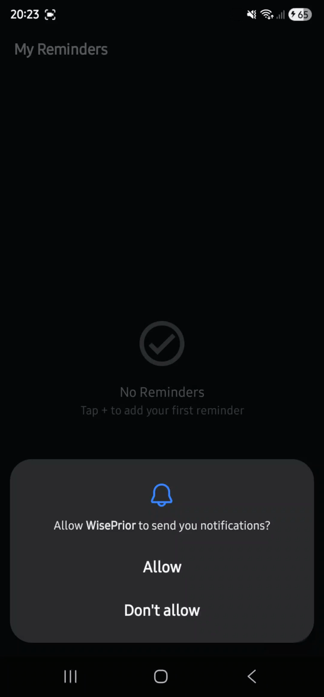

# WisePrior

A production-ready Android task manager app, built as a portfolio project to demonstrate modern Android architecture, multi-module design, and reliable background processing.

---

## Demo

|  |


## Screenshots

> _Coming soon_

---

## Architecture

Follows **Clean Architecture** with **MVVM + MVI-like** state management, based on the [Now in Android](https://github.com/android/nowinandroid) reference architecture from Google.

### Layer diagram

```
┌────────────────────────────────────────────────────────┐
│                        :app                             │
│           Navigation 3 · Hilt setup · Deep links        │
└──────────────┬────────────────────────┬────────────────┘
               │                        │
┌──────────────▼──────┐   ┌─────────────▼──────────────┐
│  :feature:tasklist  │   │    :feature:taskeditor       │
│  ViewModel · UI     │   │    ViewModel · UI            │
└──────────┬──────────┘   └─────────────┬───────────────┘
           │                            │
           └──────────────┬─────────────┘
                          │
        ┌─────────────────▼──────────────────────────┐
        │                core modules                  │
        │                                              │
        │  :core:domain  ←──────  :core:model          │
        │       ↑                                      │
        │  :core:data  ←────────  :core:storage        │
        │       ↑                                      │
        │  :core:notifications  (AlarmManager + WM)    │
        │                                              │
        │  :core:ui  ←──────────  :core:designsystem   │
        │  :core:common                                │
        └──────────────────────────────────────────────┘
```

### Module responsibilities

| Module | Responsibility |
|---|---|
| `:app` | Entry point, Hilt setup, Navigation 3 host, notification deep link handling |
| `:core:model` | Domain models (`Task`, `Priority`, `RecurrenceType`) — pure Kotlin, zero Android deps |
| `:core:domain` | `TaskRepository` interface + use cases: `GetTasks`, `GetTaskById`, `AddTask`, `UpdateTask`, `DeleteTask` |
| `:core:data` | `TaskRepositoryImpl`, `TaskMapper`, Hilt `RepositoryModule` |
| `:core:storage` | Room database v4, `TaskEntity`, `TaskDao`, `TypeConverters`, schema migrations |
| `:core:notifications` | `AlarmManagerNotificationScheduler`, `AlarmReceiver`, `BootReceiver`, `RescheduleNotificationsWorker`, `NotificationHelper` |
| `:core:designsystem` | `WisePriorTheme`, Material You colors, typography, shapes |
| `:core:ui` | Shared Compose components: `TaskCard`, `ToggleRow`, `SectionHeader`, `EmptyState`, `PriorityBadge` |
| `:core:common` | Coroutine dispatcher qualifiers (`@IoDispatcher`, `@DefaultDispatcher`, `@MainDispatcher`) |
| `:feature:tasklist` | Task list — `TaskListViewModel`, swipe-to-delete, animated list, notification cancellation on delete |
| `:feature:taskeditor` | Task editor — `TaskEditorViewModel`, date/time pickers, recurrence, notification scheduling on save |

### Dependency rules

- Feature modules depend **only** on `core` modules — never on each other
- `:core:domain` defines the repository contract; `:core:data` implements it
- `:core:storage` has no knowledge of domain models (mapping in `:core:data`)
- `:core:notifications` depends on `:core:model` and `:core:domain` (use cases for reboot reschedule)

---

## Tech stack

| Category | Library | Version |
|---|---|---|
| Language | Kotlin | 2.3.0 |
| UI | Jetpack Compose + Material 3 | BOM 2025.09.01 |
| Architecture | ViewModel + StateFlow (MVI-like UDF) | Lifecycle 2.10.0 |
| Dependency Injection | Hilt | 2.59 |
| Navigation | Navigation 3 (stable) | 1.0.0 |
| Database | Room | 2.8.3 |
| Background | AlarmManager + WorkManager | — / 2.10.0 |
| Annotation Processing | KSP | 2.3.4 |
| Build | AGP 9.0.0 + Gradle 9.1.0 | — |
| Serialization | Kotlinx Serialization | 1.7.3 |

---

## Features

### Task model

Each task carries: title, notes, URL, due date, time flag, urgent flag, priority (None / Low / Medium / High), tags, flagged marker, and recurrence type (None / Daily / Weekly / Monthly).

### Task List screen
- `LargeTopAppBar` with collapse-on-scroll behavior
- `LazyColumn` with stable keys and `animateItem()` for smooth insert/remove animations
- Swipe-to-delete with `SwipeToDismissBox` — cancels the associated alarm
- Animated empty state
- `ElevatedCard` per task with priority badge, flag icon, due date, and tag chips

### Task Editor screen
- Apple Reminders-inspired sectioned layout
- **Date picker**: Material 3 `DatePickerDialog` — selected date shown inline on the row
- **Time picker**: Material 3 `TimePicker` wrapped in `AlertDialog` — time preserved when only date changes
- **Recurrence**: `SingleChoiceSegmentedButtonRow` (None / Daily / Weekly / Monthly), visible only when date is active
- Priority selector with `SingleChoiceSegmentedButtonRow`
- Tag input with `FilterChip` and inline add/remove
- Borderless title + notes fields
- IME-aware layout (`imePadding()`)

### Reminder notifications
- Exact alarm via `AlarmManager.setExactAndAllowWhileIdle()` — fires even in Doze mode
- Tap notification → navigates directly to the task editor
- Recurring reminders reschedule automatically from the **original** due time (no drift)
- Device reboot: `BootReceiver` enqueues a WorkManager job that re-fetches all tasks and restores alarms
- Recurring tasks whose alarm time passed during reboot are advanced to the next future occurrence

### Edge-to-edge
`enableEdgeToEdge()` before `setContent`, `windowSoftInputMode="adjustResize"`, insets via `Scaffold`.

---

## State management (UDF)

Each feature follows strict Unidirectional Data Flow. Navigation is triggered via a `Channel<Unit>` — never via a boolean in `UiState` — to guarantee exactly one delivery and prevent flickering.

```
User action
    │
    ▼
ViewModel.onEvent(Event)
    │
    ▼
StateFlow<UiState> updated  ──▶  UI recomposes
    │
    ▼  (on save)
Channel<Unit>.send(Unit)    ──▶  LaunchedEffect(Unit) calls onBack() exactly once
```

```kotlin
// One-shot navigation — no boolean flag, no recomposition race
private val _navigationEvent = Channel<Unit>(Channel.BUFFERED)
val navigationEvent = _navigationEvent.receiveAsFlow()

// Screen
LaunchedEffect(Unit) {
    viewModel.navigationEvent.collect { onBack() }
}
```

---

## Notification architecture

```
User saves task with date
         │
         ▼
TaskEditorViewModel.save()
         │
         ▼
NotificationScheduler.schedule(task)          ← interface in :core:notifications
         │
         ▼
AlarmManagerNotificationScheduler             ← implementation
  setExactAndAllowWhileIdle(RTC_WAKEUP, ...)
         │
         ▼  (alarm fires)
AlarmReceiver.onReceive()
  ├── NotificationHelper.showNotification()
  └── if recurring → scheduler.scheduleFromReceiver(nextDue)

Device reboots
         │
         ▼
BootReceiver.onReceive()
         │
         ▼
WorkManager.enqueue(RescheduleNotificationsWorker)
         │
         ▼
GetTasksUseCase → rescheduleAll(tasks)
  advanceToFuture() for past recurring tasks
```

### Permission handling

| Permission | When |
|---|---|
| `POST_NOTIFICATIONS` (API 33+) | Requested at app launch via `ActivityResultContracts` |
| `SCHEDULE_EXACT_ALARM` (API 31+) | Checked before each scheduling; falls back to `setAndAllowWhileIdle` if not granted |
| `RECEIVE_BOOT_COMPLETED` | Declared in manifest, no runtime grant needed |

---

## Navigation 3

Type-safe routes implement `NavKey` and live inside each feature module. The `app` module wires them without importing any screen-level classes from features:

```kotlin
@Serializable data object TaskListRoute : NavKey
@Serializable data class TaskEditorRoute(val taskId: Long = -1L) : NavKey

// app — each feature exposes an entryProvider extension
NavDisplay(
    backStack = rememberNavBackStack(TaskListRoute),
    entryProvider = entryProvider {
        taskListEntries(onAddTask = { ... }, onEditTask = { ... })
        taskEditorEntries(onBack = { ... })
    }
)
```

Notification deep links are handled by passing `initialTaskId` from `MainActivity` to `WisePriorNavHost`, which adds `TaskEditorRoute(taskId)` to the backstack — works whether the app is cold-started or already running (`onNewIntent`).

---

## Build system

- **Version catalog** (`gradle/libs.versions.toml`) — single source of truth for all dependency versions
- **KSP** replaces KAPT for Hilt and Room — faster incremental compilation
- **AGP 9 built-in Kotlin** — `kotlin-android` plugin removed; `kotlin.jvmToolchain(17)` sets the JVM target
- **Room Gradle plugin** (`androidx.room`) — manages schema export directory and migrations
- **JDK 21** via Android Studio bundled runtime (configured in `gradle.properties`)

---

## Project structure

```
WisePrior/
├── app/
│   ├── navigation/             # WisePriorNavHost (deep link aware)
│   └── application/            # WisePriorApplication (Hilt + WorkManager + channel init)
├── core/
│   ├── common/                 # Coroutine dispatcher qualifiers
│   ├── data/                   # Repository implementation + mapper
│   ├── designsystem/           # WisePriorTheme, colors, typography, shapes
│   ├── domain/                 # Use cases + TaskRepository interface
│   ├── model/                  # Task, Priority, RecurrenceType
│   ├── notifications/          # AlarmManager scheduling, AlarmReceiver, BootReceiver
│   ├── storage/                # Room database, entities, DAOs, migrations
│   └── ui/                     # Shared Compose components
├── feature/
│   ├── taskeditor/             # Task creation/edit (date pickers, recurrence, notifications)
│   └── tasklist/               # Task list (swipe-to-delete, alarm cancellation)
├── gradle/
│   └── libs.versions.toml      # Version catalog
└── .agents/skills/             # Android Agent Skills (navigation-3, edge-to-edge, agp-9-upgrade)
```

---

## Getting started

### Requirements
- Android Studio Meerkat or later (bundled JDK 21 required)
- Android SDK 36

### Clone and run
```bash
git clone https://github.com/<your-username>/WisePrior.git
cd WisePrior
./gradlew assembleDebug
```

> **Note:** The project uses the Android Studio bundled JDK 21 (`org.gradle.java.home` in `gradle.properties`). If Android Studio is not at `/Applications/Android Studio.app/`, update that path.

---

## Author

**Gustavo Brilhante** — [gugabrilhante@gmail.com](mailto:gugabrilhante@gmail.com)
