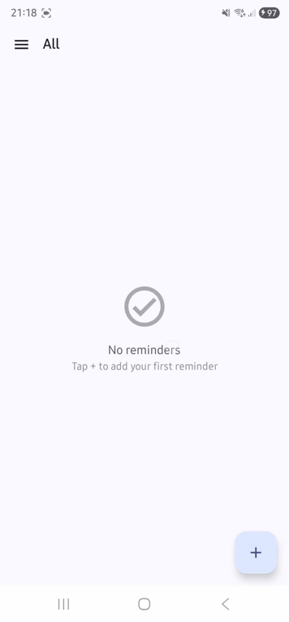
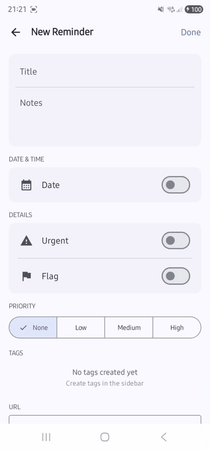
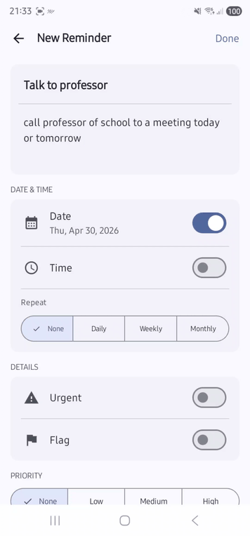
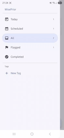
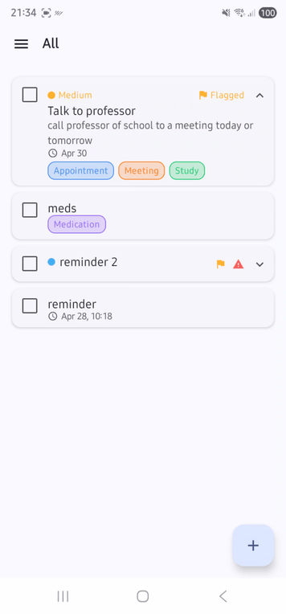
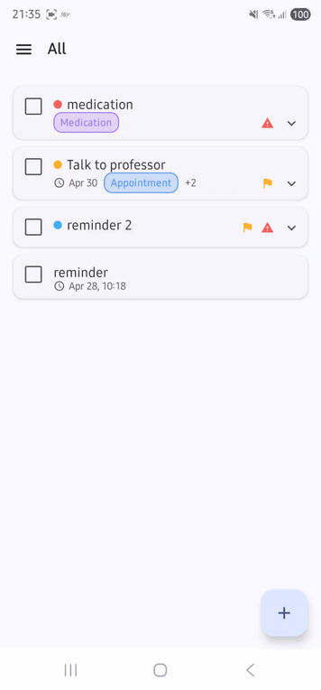
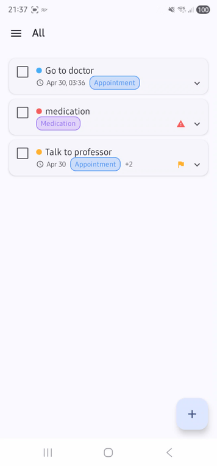
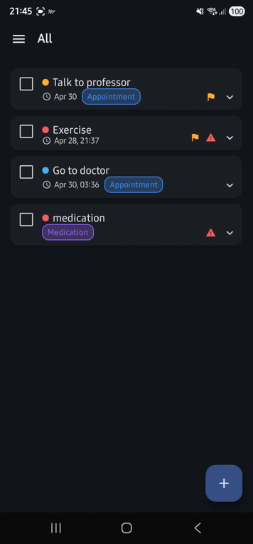

# WisePrior

[](https://github.com/gugabrilhante/WisePrior/actions/workflows/build.yml)
[](https://github.com/gugabrilhante/WisePrior/actions/workflows/unit_test.yml)
[](https://github.com/gugabrilhante/WisePrior/actions/workflows/ui_test.yml)
[](https://codecov.io/gh/gugabrilhante/WisePrior)

A production-ready Android task manager app, built as a portfolio project to demonstrate modern Android architecture, multi-module design, and reliable background processing.

---

## Demo

   
   
   

---

## Architecture

Follows **Clean Architecture** with **MVVM + MVI-like** state management, based on the [Now in Android](https://github.com/android/nowinandroid) reference architecture from Google.

### Layer diagram

```
┌────────────────────────────────────────────────────────┐
│                        :app                             │
│           Navigation 3 · Hilt setup · Deep links        │
└──────────────┬────────────────────────┬────────────────┘
               │                        │
┌──────────────▼──────┐   ┌─────────────▼──────────────┐
│  :feature:tasklist  │   │    :feature:taskeditor       │
│  ViewModel · UI     │   │    ViewModel · UI            │
└──────────┬──────────┘   └─────────────┬───────────────┘
           │                            │
           └──────────────┬─────────────┘
                          │
        ┌─────────────────▼──────────────────────────┐
        │                core modules                  │
        │                                              │
        │  :core:domain  ←──────  :core:model          │
        │       ↑                                      │
        │  :core:data  ←────────  :core:storage        │
        │       ↑                                      │
        │  :core:notifications  (AlarmManager + WM)    │
        │                                              │
        │  :core:ui  ←──────────  :core:designsystem   │
        │  :core:common                                │
        └──────────────────────────────────────────────┘
```

### Module responsibilities

| Module | Responsibility |
|---|---|
| `:app` | Entry point, Hilt setup, Navigation 3 host, notification deep link handling |
| `:core:model` | Domain models (`Task`, `Priority`, `RecurrenceType`) — pure Kotlin, zero Android deps |
| `:core:domain` | `TaskRepository` interface + use cases: `GetTasks`, `GetTaskById`, `AddTask`, `UpdateTask`, `DeleteTask` |
| `:core:data` | `TaskRepositoryImpl`, `TaskMapper`, Hilt `RepositoryModule` |
| `:core:storage` | Room database v4, `TaskEntity`, `TaskDao`, `TypeConverters`, schema migrations |
| `:core:notifications` | `AlarmManagerNotificationScheduler`, `AlarmReceiver`, `BootReceiver`, `RescheduleNotificationsWorker`, `NotificationHelper` |
| `:core:designsystem` | `WisePriorTheme`, Material You colors, typography, shapes |
| `:core:ui` | Shared Compose components: `TaskCard`, `ToggleRow`, `SectionHeader`, `EmptyState`, `PriorityBadge` |
| `:core:common` | Coroutine dispatcher qualifiers (`@IoDispatcher`, `@DefaultDispatcher`, `@MainDispatcher`) |
| `:feature:tasklist` | Task list — `TaskListViewModel`, swipe-to-delete, animated list, notification cancellation on delete |
| `:feature:taskeditor` | Task editor — `TaskEditorViewModel`, date/time pickers, recurrence, notification scheduling on save |

### Dependency rules

- Feature modules depend **only** on `core` modules — never on each other
- `:core:domain` defines the repository contract; `:core:data` implements it
- `:core:storage` has no knowledge of domain models (mapping in `:core:data`)
- `:core:notifications` depends on `:core:model` and `:core:domain` (use cases for reboot reschedule)

---

## Tech stack

| Category | Library | Version |
|---|---|---|
| Language | Kotlin | 2.3.0 |
| UI | Jetpack Compose + Material 3 | BOM 2025.09.01 |
| Architecture | ViewModel + StateFlow (MVI-like UDF) | Lifecycle 2.10.0 |
| Dependency Injection | Hilt | 2.59 |
| Navigation | Navigation 3 (stable) | 1.0.0 |
| Database | Room | 2.8.3 |
| Background | AlarmManager + WorkManager | — / 2.10.0 |
| Annotation Processing | KSP | 2.3.4 |
| Build | AGP 9.0.0 + Gradle 9.1.0 | — |
| Serialization | Kotlinx Serialization | 1.7.3 |

---

## Features

### Task model

Each task carries: title, notes, URL, due date, time flag, urgent flag, priority (None / Low / Medium / High), tags, flagged marker, and recurrence type (None / Daily / Weekly / Monthly).

### Task List screen
- `LargeTopAppBar` with collapse-on-scroll behavior
- `LazyColumn` with stable keys and `animateItem()` for smooth insert/remove animations
- Swipe-to-delete with `SwipeToDismissBox` — cancels the associated alarm
- Animated empty state
- `ElevatedCard` per task with priority badge, flag icon, due date, and tag chips

### Task Editor screen
- Apple Reminders-inspired sectioned layout
- **Date picker**: Material 3 `DatePickerDialog` — selected date shown inline on the row
- **Time picker**: Material 3 `TimePicker` wrapped in `AlertDialog` — time preserved when only date changes
- **Recurrence**: `SingleChoiceSegmentedButtonRow` (None / Daily / Weekly / Monthly), visible only when date is active
- Priority selector with `SingleChoiceSegmentedButtonRow`
- Tag input with `FilterChip` and inline add/remove
- Borderless title + notes fields
- IME-aware layout (`imePadding()`)

### Reminder notifications
- Exact alarm via `AlarmManager.setExactAndAllowWhileIdle()` — fires even in Doze mode
- Tap notification → navigates directly to the task editor
- Recurring reminders reschedule automatically from the **original** due time (no drift)
- Device reboot: `BootReceiver` enqueues a WorkManager job that re-fetches all tasks and restores alarms
- Recurring tasks whose alarm time passed during reboot are advanced to the next future occurrence

### Edge-to-edge
`enableEdgeToEdge()` before `setContent`, `windowSoftInputMode="adjustResize"`, insets via `Scaffold`.

---

## State management (UDF)

Each feature follows strict Unidirectional Data Flow. Navigation is triggered via a `Channel<Unit>` — never via a boolean in `UiState` — to guarantee exactly one delivery and prevent flickering.

```
User action
    │
    ▼
ViewModel.onEvent(Event)
    │
    ▼
StateFlow<UiState> updated  ──▶  UI recomposes
    │
    ▼  (on save)
Channel<Unit>.send(Unit)    ──▶  LaunchedEffect(Unit) calls onBack() exactly once
```

```kotlin
// One-shot navigation — no boolean flag, no recomposition race
private val _navigationEvent = Channel<Unit>(Channel.BUFFERED)
val navigationEvent = _navigationEvent.receiveAsFlow()

// Screen
LaunchedEffect(Unit) {
    viewModel.navigationEvent.collect { onBack() }
}
```

---

## Notification architecture

```
User saves task with date
         │
         ▼
TaskEditorViewModel.save()
         │
         ▼
NotificationScheduler.schedule(task)          ← interface in :core:notifications
         │
         ▼
AlarmManagerNotificationScheduler             ← implementation
  setExactAndAllowWhileIdle(RTC_WAKEUP, ...)
         │
         ▼  (alarm fires)
AlarmReceiver.onReceive()
  ├── NotificationHelper.showNotification()
  └── if recurring → scheduler.scheduleFromReceiver(nextDue)

Device reboots
         │
         ▼
BootReceiver.onReceive()
         │
         ▼
WorkManager.enqueue(RescheduleNotificationsWorker)
         │
         ▼
GetTasksUseCase → rescheduleAll(tasks)
  advanceToFuture() for past recurring tasks
```

### Permission handling

| Permission | When |
|---|---|
| `POST_NOTIFICATIONS` (API 33+) | Requested at app launch via `ActivityResultContracts` |
| `SCHEDULE_EXACT_ALARM` (API 31+) | Checked before each scheduling; falls back to `setAndAllowWhileIdle` if not granted |
| `RECEIVE_BOOT_COMPLETED` | Declared in manifest, no runtime grant needed |

---

## Navigation 3

Type-safe routes implement `NavKey` and live inside each feature module. The `app` module wires them without importing any screen-level classes from features:

```kotlin
@Serializable data object TaskListRoute : NavKey
@Serializable data class TaskEditorRoute(val taskId: Long = -1L) : NavKey

// app — each feature exposes an entryProvider extension
NavDisplay(
    backStack = rememberNavBackStack(TaskListRoute),
    entryProvider = entryProvider {
        taskListEntries(onAddTask = { ... }, onEditTask = { ... })
        taskEditorEntries(onBack = { ... })
    }
)
```

Notification deep links are handled by passing `initialTaskId` from `MainActivity` to `WisePriorNavHost`, which adds `TaskEditorRoute(taskId)` to the backstack — works whether the app is cold-started or already running (`onNewIntent`).

---

## Build system

- **Version catalog** (`gradle/libs.versions.toml`) — single source of truth for all dependency versions
- **KSP** replaces KAPT for Hilt and Room — faster incremental compilation
- **AGP 9 built-in Kotlin** — `kotlin-android` plugin removed; `kotlin.jvmToolchain(17)` sets the JVM target
- **Room Gradle plugin** (`androidx.room`) — manages schema export directory and migrations
- **JDK 21** via Android Studio bundled runtime (configured in `gradle.properties`)

---

## Project structure

```
WisePrior/
├── app/
│   ├── navigation/             # WisePriorNavHost (deep link aware)
│   └── application/            # WisePriorApplication (Hilt + WorkManager + channel init)
├── core/
│   ├── common/                 # Coroutine dispatcher qualifiers
│   ├── data/                   # Repository implementation + mapper
│   ├── designsystem/           # WisePriorTheme, colors, typography, shapes
│   ├── domain/                 # Use cases + TaskRepository interface
│   ├── model/                  # Task, Priority, RecurrenceType
│   ├── notifications/          # AlarmManager scheduling, AlarmReceiver, BootReceiver
│   ├── storage/                # Room database, entities, DAOs, migrations
│   └── ui/                     # Shared Compose components
├── feature/
│   ├── taskeditor/             # Task creation/edit (date pickers, recurrence, notifications)
│   └── tasklist/               # Task list (swipe-to-delete, alarm cancellation)
├── gradle/
│   └── libs.versions.toml      # Version catalog
└── .agents/skills/             # Android Agent Skills (navigation-3, edge-to-edge, agp-9-upgrade)
```

---

## Quality Engineering & Test Strategy

WisePrior treats testing as a first-class concern, not an afterthought. The strategy is designed to give fast feedback during development, prevent regressions on every pull request, and build long-term confidence in the codebase — the same standards expected in production Android teams.

---

### 🏗️ Test Pyramid

The project follows the classic **Test Pyramid** principle: favour many fast, isolated unit tests at the base; a smaller set of integration tests in the middle; and targeted UI tests at the top for critical user flows.

```
         ▲
        /  \          UI / End-to-End
       / UI \         (Espresso — critical flows)
      /──────\
     /        \       Integration
    / Integrat.\      (Room in-memory, Repository + DataSource)
   /────────────\
  /              \    Unit tests
 /   Unit Tests   \   (Use Cases, ViewModels, Repositories, Mappers)
/──────────────────\
```

| Level | Speed | Confidence | Cost |
|---|---|---|---|
| Unit | ⚡ Milliseconds | Business logic & edge cases | Low — pure JVM, no device |
| Integration | 🕐 Seconds | Data persistence & real SQL behaviour | Medium — requires emulator |
| UI | 🕑 Minutes | End-to-end user flows | High — full app stack |

**Why prioritise unit tests?** They run in milliseconds on the JVM without any Android framework, give immediate feedback on business rule regressions, and are trivial to run locally or in CI. Unit tests cover the vast majority of logic; integration and UI tests verify the seams between layers.

---

### 🧪 Unit Tests

Unit tests target every layer of the Clean Architecture stack — use cases, repositories, mappers, and view models — using fakes and mocks to keep each test fully isolated.

**What is covered**

| Module | Classes under test |
|---|---|
| `core:domain` | All 9 use cases: `GetTasksUseCase`, `AddTaskUseCase`, `UpdateTaskUseCase`, `DeleteTaskUseCase`, `GetTaskByIdUseCase`, `GetTagsUseCase`, `AddTagUseCase`, `UpdateTagUseCase`, `DeleteTagUseCase` |
| `core:data` | `TaskRepositoryImpl`, `TagRepositoryImpl`, `TaskMapper`, `TagMapper` |
| `core:storage` | `Converters` (Room TypeConverter round-trips) |
| `feature:tasklist` | `TaskListViewModel` — state emissions, deletion, error handling, all 6 collection filters, tag editor with MAX_TAGS enforcement |
| `feature:taskeditor` | `TaskEditorViewModel` — task loading, all `TaskEditorEvent` types, save validation, date/time preservation, notification scheduling |

**Tools**

| Tool | Role |
|---|---|
| **JUnit 4** | Test runner and base assertions |
| **MockK 1.13** | Kotlin-idiomatic mocking — `mockk(relaxed = true)`, slot capture, `coVerify` |
| **Turbine 1.2** | `StateFlow` / `Flow` testing: `awaitItem()`, `cancelAndIgnoreRemainingEvents()` |
| **kotlinx.coroutines.test** | `runTest`, `UnconfinedTestDispatcher`, `Dispatchers.setMain/resetMain` |

**Naming convention** — every test name is self-documenting using the `given / when / then` format:

```kotlin
@Test
fun `given active ByTag collection, when that tag deleted, then selection falls back to All`()

@Test
fun `given tag count at maximum, when saveTag called for new tag, then error is set and tag is not added`()
```

**Key scenarios**

- All collection filters (All, Today, Scheduled, Flagged, Completed, ByTag) verified in isolation
- `CollectionCounts` always totals the unfiltered list, even when a collection is active
- Tag limit of 5 enforced — error message set, use case never called
- `ToggleDate` off cascades: clears `hasTime` and resets `recurrenceType` to `NONE`
- Save trims whitespace from title, notes, and URL before persisting
- `TitleChanged` clears `titleError`; blank title on Save sets it

---

### 🔗 Integration Tests

Integration tests wire real collaborators together against an **in-memory Room database**, removing all mocks from the persistence layer. They validate the full data flow — from the repository interface down to SQLite — and catch issues that unit tests cannot: schema mismatches, TypeConverter errors, DAO query bugs, and reactive Flow behaviour.

**What is validated**

| Test class | Stack exercised |
|---|---|
| `TaskDaoIntegrationTest` | `TaskDao` ↔ Room in-memory SQLite — insert, query, update, delete, ordering by `createdAt DESC`, Flow reactivity after insert |
| `TaskRepositoryIntegrationTest` | `TaskRepositoryImpl → TaskDataSource → TaskDao → SQLite` — full domain model round-trip, `getTasks` Flow, `getTaskById`, update, delete |

**Why in-memory database?**
Each test gets a fresh `Room.inMemoryDatabaseBuilder` instance that is closed in `@After`. There is no shared state between tests, no leftover rows, and no need to clean up — tests are deterministic and can run in any order.

```kotlin
@Before
fun setup() {
    database = Room.inMemoryDatabaseBuilder(
        ApplicationProvider.getApplicationContext(),
        AppDatabase::class.java
    ).allowMainThreadQueries().build()
}
```

**Key scenarios**

- Domain model survives `toEntity() → toModel()` without field loss for all `Priority` and `RecurrenceType` variants
- `getAllTasks` Flow emits a new list immediately after an insert within the same observation (reactive SQLite)
- `getTaskById` returns `null` for unknown IDs — no crash, no exception
- `deleteTask` followed by `getTasks` yields an empty list

---

### 📱 UI / End-to-End Tests *(planned)*

Espresso UI tests are planned to cover the critical happy paths that no unit or integration test can fully validate — real user gestures, IME behaviour, and screen transitions.

**Target flows**

- Create a task → verify it appears in the list
- Swipe-to-delete a task → verify it is removed
- Open task editor → fill all fields → save → verify persistence
- Toggle task completion → verify notification cancellation

These tests will run as part of the `connectedDebugAndroidTest` Gradle task and will be gated in CI the same way as unit tests.

---

### ⚙️ CI/CD Integration

Every pull request triggers the full test suite automatically via the CI pipeline. No code reaches `main` without passing:

1. **Unit tests** (`./gradlew testDebugUnitTest`) — run on every commit, sub-minute feedback
2. **Integration tests** (`./gradlew connectedDebugAndroidTest`) — run on PRs against an emulator

This fast-feedback loop means regressions are caught at the source — in the PR — before they ever reach the main branch or a release build.

---

### 📊 Code Coverage

Coverage is measured with **JaCoCo** to track which lines and branches are exercised by the test suite. Coverage is treated as a tool for finding gaps, not a target to game — a 100% number with trivial tests is worth less than 70% coverage of genuinely complex business logic.

| Module | Approximate coverage |
|---|---|
| `core:domain` (use cases) | ~95% |
| `core:data` (repositories + mappers) | ~90% |
| `core:storage` (converters) | ~100% |
| `feature:tasklist` (ViewModel) | ~85% |
| `feature:taskeditor` (ViewModel) | ~90% |

> Coverage percentages are approximate and reflect the current unit + integration test suite. UI test coverage will increase these figures once Espresso tests are added.

Generate a coverage report locally:
```bash
./gradlew testDebugUnitTest jacocoTestReport
# Report: build/reports/jacoco/jacocoTestReport/html/index.html
```

---

### 💡 Engineering Mindset

Good tests are not just about catching bugs today — they are documentation, a safety net for refactoring, and a forcing function for better design. Every test class in WisePrior was written with three goals in mind:

- **Isolation**: each test owns its dependencies and fails for one reason only
- **Readability**: a failing test name tells you exactly what broke and why, without reading the implementation
- **Maintainability**: fakes and relaxed mocks are preferred over brittle over-specification, so tests survive internal refactors

As the feature set grows, the same patterns extend naturally: new use cases get new test classes, new ViewModel state gets new `given/when/then` cases, and new DAO queries get new in-memory integration tests. Quality engineering scales with the codebase, not against it.

---

### Running the tests

```bash
# All unit tests across all modules
./gradlew testDebugUnitTest

# Integration tests (connected device or emulator required)
./gradlew connectedDebugAndroidTest

# Single module
./gradlew :feature:tasklist:testDebugUnitTest
./gradlew :core:storage:connectedDebugAndroidTest
```

---

## Getting started

### Requirements
- Android Studio Meerkat or later (bundled JDK 21 required)
- Android SDK 36

### Clone and run
```bash
git clone https://github.com/<your-username>/WisePrior.git
cd WisePrior
./gradlew assembleDebug
```

> **Note:** The project uses the Android Studio bundled JDK 21 (`org.gradle.java.home` in `gradle.properties`). If Android Studio is not at `/Applications/Android Studio.app/`, update that path.

---

## Author

**Gustavo Brilhante** — [gugabrilhante@gmail.com](mailto:gugabrilhante@gmail.com)
